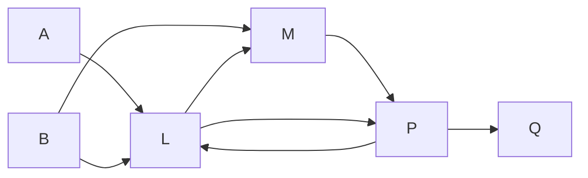

## Knowledge-Based Agents

基于知识的智能体的核心部件是`知识库` (Knowledge base, KB)，知识库是语句的集合；语句用知识表示语言 (knowledge representation language) 表示，是关于世界的断言/陈述；直接给出（并非推导而来）的语句称为公理 (axiom)。

知识库涉及的操作主要有告知 (tell) 和询问 (ask) 两种，当向KB询问时，答案应当遵循告知的内容而得出。

语句是根据语法 (syntax) 构造的，语法是语句的合法形式；语义 (semantics) 是语句的含义，语义定义了语句的真值 (truth)，在不同的模型 (model) 中，语句的真值可能不同。

## Logic

在一个模型 (model)中，语句的真值 (truth) 是确定的。如果语句$$\alpha$$在模型$$m$$中为真，我们说$$m$$满足$$\alpha$$，或者说$$m$$是$$\alpha$$的一个模型。所有满足$$\alpha$$的模型的集合称为$$\alpha$$的模型集合，记为$$M(\alpha)$$。

### Entailment (蕴含)

$$\alpha$$蕴含$$\beta$$当且仅当$$\alpha$$的所有模型都是$$\beta$$的模型，记为$$\alpha \models \beta$$，也就是说$$\alpha$$的模型是$$\beta$$模型集合的子集。例如$$\alpha$$为$$x=0$$，$$\beta$$为$$xy=0$$，显然$$\alpha$$是比$$\beta$$更强的断言。

$$
\alpha \models \beta \Leftrightarrow M(\alpha) \subseteq M(\beta)
$$

### 逻辑推断

对于一个智能体的知识库$$KB$$和一个语句$$\alpha$$，$$KB$$可以看作一组语句的集合或一个断言了所有语句的语句；所有使得$$KB$$为真的模型的集合称为$$KB$$的模型集合，记为$$M(KB)$$。

比较$$M(KB)$$和$$M(\alpha)$$的关系的过程称为[`模型检验`](#truth-table-enumeration-真值表枚举)，是一种枚举式的推断算法。
如果$$M(KB) \subseteq M(\alpha)$$，则称$$\alpha$$可以从$$KB$$推出，记为$$KB \models \alpha$$；如果一个推断算法$$i$$可以从$$KB$$推出$$\alpha$$，则记为

$$
KB \vdash_i \alpha
$$

如果$$KB$$在现实世界中为真，那么从$$KB$$推出的语句也应当在现实世界中为真，前提是这个推断过程是可靠的。

### Soundness (可靠性)

如果一个推断算法$$i$$是可靠的，那么对于任何$$KB$$和$$\alpha$$，如果$$KB \vdash_i \alpha$$，那么$$KB \models \alpha$$，也就是说仅推导蕴含的语句。

`模型检验`在模型空间`有限`的情况下是`可靠`/`保真`的。

### Completeness (完备性)

如果一个推断算法$$i$$是完备的，那么对于任何$$KB$$和$$\alpha$$，如果$$KB \models \alpha$$，那么$$KB \vdash_i \alpha$$，也就是说能推导出所有蕴含的语句。

## Propositional Logic (命题逻辑)

### Syntax (语法)

语法定义了语句的合法形式。

`原子语句` (atomic sentence) 是最基本的语句，它们是`命题符号` (propositional symbol)，用字母$$P, q, W_{1,3}, \dots$$表示，它们表示命题，命题的真值是确定的。

使用括号和`逻辑联结词` (logical connective) 可以构造`复合语句` (complex sentence)；复合语句的真值依赖于原子语句的真值和逻辑联结词。常用的逻辑联结词有:

- 否定 (negation)：$$\neg P$$，$$P$$的否定
- 合取 (conjunction)：$$P \land Q$$，$$P$$和$$Q$$的合取
- 析取 (disjunction)：$$P \lor Q$$，$$P$$和$$Q$$的析取
- 蕴含 (implication)：$$P \Rightarrow Q$$，$$P$$蕴含$$Q$$；$$P$$是前提 (premise)或前件 (antecedent)，$$Q$$是结论 (conclusion)或后件 (consequent)；蕴含式也被称为规则 (rule) 或if-then声明
- 双蕴含 (biconditional)：$$P \Leftrightarrow Q$$，$$P$$当且仅当$$Q$$

### Semantics (语义)

语义定义了判断语句真值的规则。

模型就是对每个命题符号的真值的赋值，对于一个含有$$n$$个命题符号的$$KB$$，它有$$2^n$$个可能的模型。

命题逻辑的语义必须指定在给定模型下如何计算任一语句的真值，即需要指定如何计算原子语句的真值和如何计算复合语句的真值。对于不同的逻辑联结词，复合语句的规则如下:

- $$\neg P$$的真值为真当且仅当$$P$$的真值在模型中为假
- $$P \land Q$$的真值为真当且仅当$$P$$和$$Q$$的真值在模型中都为真
- $$P \lor Q$$的真值为真当且仅当$$P$$和$$Q$$的真值在模型中至少有一个为真
- $$P \Rightarrow Q$$的真值为真除非$$P$$为真而$$Q$$为假
- $$P \Leftrightarrow Q$$的真值为真当且仅当$$P$$和$$Q$$的真值在模型中相同

可以看出:

- $$P \Leftrightarrow Q$$等价于$$(P \Rightarrow Q) \land (Q \Rightarrow P)$$
- $$P \Rightarrow Q$$等价于$$\neg P \lor Q$$

### Inference (推断)

#### Truth Table Enumeration (真值表枚举)

真值表枚举是一种枚举式的推断算法，它枚举了所有可能的模型，然后检查$$KB$$是否是$$\alpha$$的模型的子集。

最坏的情况下，真值表枚举的时间复杂度是$$O(2^n)$$，其中$$n$$是命题符号的个数，空间复杂度是$$O(n)$$，因为枚举的模型是深度优先的，只需要存储每个命题符号的真值。

#### [Modus Ponens](#modus-ponens-肯定前提)

#### [And-Elimination](#and-elimination-合取消去)

#### [Resolution](#proof-by-resolution-归结证明) (归结)

## Propositional Theorem Proving (命题定理证明)

逻辑等价 (logical equivalence)：如果两个语句在相同的模型集合中都为真，那么它们是逻辑等价的，记为$$\alpha \equiv \beta$$[^1]。

[^1]: $$\equiv$$用于对语句进行声明，而$$\Leftrightarrow$$是语句的一部分。

标准的逻辑等价包括:

$$
\begin{aligned}
\text{交换律 }
\alpha \land \beta &\equiv \beta \land \alpha \\
\alpha \lor \beta &\equiv \beta \lor \alpha \\
\text{结合律 }
(\alpha \land \beta) \land \gamma &\equiv \alpha \land (\beta \land \gamma) \\
(\alpha \lor \beta) \lor \gamma &\equiv \alpha \lor (\beta \lor \gamma) \\
\neg (\neg \alpha) &\equiv \alpha \\
\alpha \Rightarrow \beta &\equiv \neg \beta \Rightarrow \neg \alpha \\
\alpha \Rightarrow \beta &\equiv \neg \alpha \lor \beta \\
\alpha \Leftrightarrow \beta &\equiv (\alpha \Rightarrow \beta) \land (\beta \Rightarrow \alpha) \\
\neg (\alpha \land \beta) &\equiv \neg \alpha \lor \neg \beta \\
\neg (\alpha \lor \beta) &\equiv \neg \alpha \land \neg \beta \\
\text {分配律 } \alpha \land (\beta \lor \gamma) &\equiv (\alpha \land \beta) \lor (\alpha \land \gamma) \\
\alpha \lor (\beta \land \gamma) &\equiv (\alpha \lor \beta) \land (\alpha \lor \gamma) \\
\end{aligned}
$$

逻辑等价的另一种定义是两个语句`互相蕴含`

$$
\alpha \equiv \beta \text{ 当且仅当 } \alpha \models \beta \text{ and } \beta \models \alpha
$$

有效性 (validity)：如果一个语句在所有模型中都为真，那么它是有效的，有效语句也被称为重言式 (tautology)，如$$P \lor \neg P$$；从蕴含可以推导出古希腊人的演绎定理:

$$
\alpha \models \beta \text{ 当且仅当语句 } \alpha \Rightarrow \beta \text{ 是有效的}
$$

因此，如果$$\alpha \models \beta$$可以通过检验$$\alpha \Rightarrow \beta$$是否是有效 (等价于True)的来判断；$$\alpha \Rightarrow \beta$$是有效的当且仅当$$\alpha \land \neg \beta$$是不可满足的。

可满足性 (satisfiability)：如果一个语句在某个模型中为真，那么它是可满足的，可满足语句也被称为可满足的 (satisfiable)。

有效性和可满足性的关系：

- $$\alpha$$是有效的当且仅当$$\neg \alpha$$是不可满足的
- $$\alpha$$是可满足的当且仅当$$\neg \alpha$$是无效的
- $$\alpha \models \beta$$当且仅当$$\alpha \land \neg \beta$$是无效的[^2]

[^2]: $$\alpha \models \beta$$当且仅当$$\alpha \Rightarrow \beta$$是有效的，等价于$$\neg \alpha \lor \beta$$是有效的，等价于$$\neg (\neg \alpha \lor \beta)$$是无效的，等价于$$\alpha \land \neg \beta$$是无效的。

### Inference and proofs (推断和证明)[^3]

[^3]: 肯定前提和合取消去是可靠的，不必进行枚举就可以得到正确的结果。

#### Modus Ponens (肯定前提)

若$$KB$$中有$$P \Rightarrow Q$$和$$P$$，则可以推出$$Q$$。

$$
\frac{P \Rightarrow Q, P}{Q}
$$

#### And-Elimination (合取消去)

若$$KB$$中有$$P \land Q$$，则可以推出$$P$$和$$Q$$。

$$
\frac{P \land Q}{P}
$$

#### 单调性

如果$$KB \models \alpha$$，那么$$KB \land \beta \models \alpha$$；也就是说，蕴含 (entailment)的语句集合只能随着信息的增加而增加。

### Proof by Resolution (归结证明)

单元归结 (unit resolution)：如果$$KB$$中有$$P$$和$$\neg P \lor Q$$，则可以推出$$Q$$；单元归结推断适用于一个`文字`和一个文字的`析取式`/子句，并生成一个新的`子句` (clause)；单个文字也可以看做一个`单元子句`。

$$
\frac{l_1\lor \dots \lor l_n, m}{l_1\lor \dots \lor l_{i-1} \lor l_{i+1} \lor \dots \lor l_n} \text{ if } l_i = \neg m
$$

全归结 (full resolution)：如果$$KB$$中有$$P \lor Q$$和$$\neg P \lor R$$，则可以推出$$Q \lor R$$；全归结推断适用于两个`析取子句`，并生成一个新的`子句`。If $$l_i$$ and $$m_j$$ are `complementary literals`, then

$$
\frac{l_1\lor \dots \lor l_n, m_1\lor \dots \lor m_k}{l_1\lor \dots \lor l_{i-1} \lor l_{i+1} \lor \dots \lor l_n \lor m_1\lor \dots \lor m_{j-1} \lor m_{j+1} \lor \dots \lor m_k} \text{ if } l_i = \neg m_j
$$

#### Conjunctive Normal Form (合取范式, CNF)

形式上为子句的合取式，每个子句都是文字的析取式，例如$$(P \lor Q) \land (\neg P \lor R)$$，这样的合取式称为合取范式。将子句转换为合取范式的过程包括:

- 将双蕴含转换为蕴含: $$P \Leftrightarrow Q \equiv (P \Rightarrow Q) \land (Q \Rightarrow P)$$
- 将蕴含转换为析取: $$P \Rightarrow Q \equiv \neg P \lor Q$$
- 将$$\neg$$内移到文字上/子句中

$$
\begin{aligned}
\neg (\neg P) &\equiv P \\
\neg (P \land Q) &\equiv \neg P \lor \neg Q \\
\neg (P \lor Q) &\equiv \neg P \land \neg Q \\
\end{aligned}
$$

- 使用分配律将析取内的合取转换为合取内的析取: $$P \lor (Q \land R) \equiv (P \lor Q) \land (P \lor R)$$

#### A Resolution Algorithm (归结算法)

归结算法的输入是一个合取范式$$KB$$和一个语句$$\alpha$$，为了证明$$KB$$蕴含$$\alpha$$，我们要证明$$KB \land \neg \alpha$$是不可满足的。

归结算法的过程如下:

1. 将$$KB \land \neg \alpha$$转换为合取范式
2. 应用归结规则生成新的子句，如果新子句没有出现过，那么将它加入到$$KB$$中
3. 重复步骤2直到无法生成新的子句或者生成了空子句，此时
   1. 如果生成了空子句，那么$$KB \land \neg \alpha$$是不可满足的，也就是说$$KB \models \alpha$$
   2. 如果无法生成新的子句，那么$$KB \land \neg \alpha$$是可满足的，也就是说$$KB \not\models \alpha$$

#### Completeness of the Resolution Algorithm (归结算法的完备性)

归结闭包 (resolution closure, RC)：子句集合$$S$$的归结闭包是子句集合的所有子句及使用归结规则生成的所有子句的集合。因为$$S$$中的文字是有限的，所以有这些文字生成的子句也是有限的，因此$$RC(S)$$是有限的。

基本归结定理 (ground resolution theorem)：如果$$S$$的归结闭包包含空子句，那么$$S$$是不可满足的。定理的反证如下:

1. 假设$$RC(S)$$是可满足的，那么$$S$$的模型集合$$M(S)$$是非空的，至少存在一个构建在文字$$p_1, \dots, p_n$$上的模型$$m$$，其中$$p_1, \dots, p_n$$是$$S$$中的所有文字。
2. 对于$$RC(S)$$中的某个子句，如果包含$$\neg p_i$$并且所有其他文字$$p_1, \dots, p_{i-1}$$的赋值为假，那么$$p_i$$的赋值为假，否则$$p_i$$的赋值为真。
3. 考虑$$RC(S)$$中的子句序列，由于它是闭包的，必然同时存在$$p_1 \lor \dots \lor p_{i-1}\lor p_i$$和$$p_1 \lor \dots \lor p_{i-1}\lor \neg p_i$$，假设其中一个子句为假[^4]，那么$$p_1, \dots, p_{i-1}$$的赋值都为假，这与假设`第一个假子句`矛盾[^5]。
4. 因此$$RC(S)$$中的所有子句都为真，也就是说$$RC(S)$$是可满足的，即若$$RC(S)$$是可满足的，那么$$RC(S)$$中不存在空子句。
5. 又因为$$RC(S)$$的模型也是$$S$$的模型，所以$$S$$是可满足的。

[^4]: 该子句序列是有序的，由$$p_1, \dots, p_i$$组成，被假设为第一个假的子句

[^5]: 因为$$RC(S)$$是闭包的且$$p_1, \dots, p_{i-1}$$被赋值为假，所以单元子句的赋值即存在假的情况，说明实际上假子句出现的更早，这与$$p_1 \lor \dots \lor p_{i-1}\lor p_i$$或$$p_1 \lor \dots \lor p_{i-1}\lor \neg p_i$$是第一个假子句的假设矛盾

###  Horn Clauses (霍恩子句)

确定子句 (definite clause)：只有一个正文字的析取式，例如$$P$$或$$\neg P \lor Q \lor \neg R$$。

霍恩子句 (Horn clause)：至多只有一个正文字的析取式[^6]，例如$$P$$或$$\neg P \lor Q$$或$$\neg P \lor \neg Q \lor \neg R$$；所有的确定子句都是霍恩子句；没有正文字的霍恩子句称为`目标子句` (goal clause)。

[^6]: 霍恩子句在归结时是闭的，也就是说两个霍恩子句的归结结果也是霍恩子句；用霍恩子句进行推断可以通过前向链接和反向链接实现。

### Forward Chaining (前向链接)

前向链接算法查询单个命题符号$$q$$是否被确定子句的知识库$$KB$$蕴含，它从知识库的已知事实开始；如果一个蕴含式的前提都是已知的，那么它的结论也是已知的，就将结论添加到已知事实中；重复这个过程直到$$q$$被确定或者无法推出新的结论。



```python
# Forward chaining algorithm
"""
假定KB中的子句数量为n，文字数量为m
查询q是否被KB蕴含
"""
class Clause:
    def __init__(self, premises, conclusion):
      assert isinstance(premises, (list, tuple, set))
      self.premises = premises # 前提
      self.conclusion = conclusion # 结论
      self.count = len(premises) # 前提数量
      self.set_premises = set(premises) # 前提集合

clauses = [
  Clause(['P'], 'Q'), # P蕴含Q
  Clause(['L', 'M'], 'P'), # L且M蕴含P
  Clause(['B', 'L'], 'M'), # B且L蕴含M
  Clause(['A', 'P'], 'L'), # A且P蕴含L
  Clause(['A', 'B'], 'L'), # A且B蕴含L
] # KB

queue = ['A', 'B'] # 已知事实
count = [c.count for c in clauses] # 子句的前提数量
value = {} # 已知事实的真值，初始化为False
for c in clauses:
  value[c.conclusion] = False # 初始化文字的真值
  for p in c.set_premises:
    value[p] = False # 初始化文字的真值
entailed = False # 是否蕴含
while len(queue) > 0:
  p = queue.pop(0) # 从已知事实中取出一个命题符号
  if p == 'Q': # 如果已知事实中有Q，那么Q被蕴含
    entailed = True
    break # 结束
  if value[p]:
    continue
  value[p]=True # 将p的真值设为True，表明p是已知的
  for c in clauses:
    if p in c.set_premises:
      c.count -= 1 # 将p作为前提的子句的前提数量减1
      if c.count == 0: # 如果子句的前提数量为0，那么子句的结论被蕴含
        queue.append(c.conclusion) # 将子句的结论添加到已知事实中
if entailed:
  print('Q is entailed')
else:
  print('Q is not entailed')
```

前向链接是可靠且完备的：考虑上述算法终止时的value表，每个已知或推得的命题符号的真值都为True，其余为False，可以将其看做一个模型，原始$$KB$$的子句在这个模型中都为真；假设存在原始子句$$\alpha_1\land\dots\land\alpha_n\Rightarrow\beta$$为假，那么$$\alpha_1\land\dots\land\alpha_n$$为真，$$\beta$$为假，此时可以将$$\beta$$添加到已知事实中，算法终止时$$\beta$$的真值为True，矛盾，因此所有蕴含的原始子句必然会被推出，说明前向链接是完备的。

前向链接是数据驱动 (data-driven) 的，相比之下，反向链接是一种目标导向推理 (goal-directed reasoning)，它从目标开始推理，仅涉及相关事实，因此代价更低。

## Agents Based on Propositional Logic (基于命题逻辑的智能体)