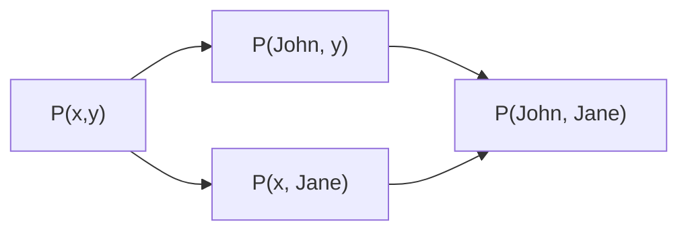
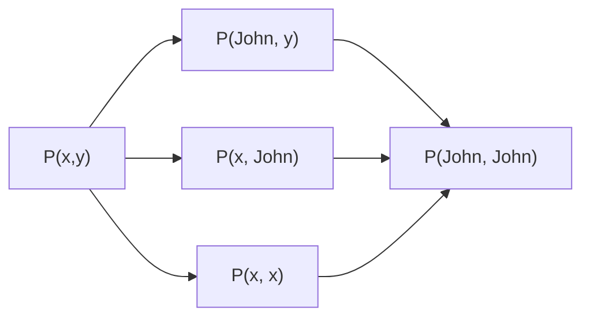

# First-Order Logic

## Syntax and Semantics of First-Order Logic

### Models for First-Order Logic

模型的域 (domain) 是一个非空集合，包含模型的对象。

模型中的对象间可能有关系 (relation)，关系是相关对象的元组集。

一阶逻辑中的模型需要全函数 (total function)，对所有输入的对象或元组都有输出。

### Symbols and Interpretations

一阶逻辑的基本语法元素包括:

- 常量 (constant): 代表对象
- 谓词 (predicate): 代表关系[^1]
- 函数 (function): 代表一种映射[^1]

[^1]: 每个谓词和函数符号都有一个决定参数数量的元数 (arity)。

每个模型必须提供所需的信息来确定任意给定语句为真还是为假。因此，除了它的对象、关系和函数，每个模型还要包含一套确切指明常量、谓词和函数符号指代的是哪个对象、关系和函数的解释 (interpretation)。

一阶逻辑中的模型包含一个对象集和一种解释，这种解释将常量符号映射到对象、将函数符号映射到关于这些对象的函数，将谓词符号映射到关系。与命题逻辑一样，蕴含、有效性等都是用所有可能模型来定义的[^2]。

[^2]: 一阶逻辑模型数量没有上限，无法通过枚举所有模型的方式来检验蕴含。

### Terms (项)

项是指代对象的逻辑表达式，可以是常量或函数的值 (函数应用于对象而产生的对象)。

### Atomic Sentences (原子语句)

将指代对象的项与指代关系的谓词符号结合起来，就可以得到原子语句[^3]。

[^3]: 对于原子语句$$P(x,y)$$，一般遵循$$x$$是$$y$$的$$P$$的关系。

如果谓词符号所指代的关系在参数所指代的对象之间成立，则在给定模型中原子句为真。

### Complex Sentences (复合语句)

复合语句是由原子语句和逻辑连接词 (logical connective) 构成的语句。比如，$$P(x,y) \land Q(x)$$。

### Quantifiers (量词)

量词是用来指定变量的范围的；一阶逻辑中有两种量词：全称量词 (universal quantifier) $$\forall$$ 和存在量词 (existential quantifier) $$\exists$$，它们的关系为:

$$
\begin{aligned}
\lnot \forall x P(x) &\equiv \exists x \lnot P(x) & \lnot (P \lor Q) &\equiv \lnot P \land \lnot Q \\
\lnot \exists x P(x) &\equiv \forall x \lnot P(x) & \lnot (P \land Q) &\equiv \lnot P \lor \lnot Q \\
\forall x P(x) &\equiv \lnot \exists x \lnot P(x) & P \land Q &\equiv \lnot (\lnot P \lor \lnot Q) \\
\exists x P(x) &\equiv \lnot \forall x \lnot P(x) & P \lor Q &\equiv \lnot (\lnot P \land \lnot Q)
\end{aligned}
$$

一般来说，$$\forall$$通常和$$\Rightarrow$$一起使用，$$\exists$$通常和$$\land$$一起使用。

$$
\begin{aligned}
\forall x & At(x, Berkeley) \Rightarrow Smart(x)\\
\exists x & At(x, Berkeley) \land Smart(x)
\end{aligned}
$$

一种错误的表达是$$\forall x At(x, Berkeley) \land Smart(x)$$，他的意思是所有人都在伯克利并且聪明，而不是在伯克利的人都聪明。

### Equality (等词)

等词表示两个项指代的对象相等，它是一种特殊的谓词符号，用 $$=$$ 表示；$$x\neq y$$ 可以表示为 $$\lnot (x=y)$$。

## Using First-Order Logic

### Assertions and Queries

语句是通过Tell添加到知识库的，与在命题逻辑中完全一样，这种语句被称为断言 (assertion)。

$$
Tell(KB, Person(John))
$$

使用Ask提出的问题被称为查询或目标 (query)。

$$
Ask(KB, Person(John))
$$

返回的结果是一个布尔值，表示查询是否为真，这里返回的结果是真。也可以提出量化的问题:

$$
Ask(KB, \exists x Person(x))
$$

这里返回的结果是真，因为存在一个人。但我们更想知道的是这个人是谁，所以我们可以使用AskVars，它返回一个变量的绑定 (binding) 列表/置换 (substitution)，这里返回的结果是$$\{x/John\}$$。

### Numbers, Sets, and Lists

本节演示了如何使用一阶逻辑来表示数字、集合和列表。

#### Numbers

以定义自然数为例，需要谓词$$NatNum$$判断一个对象是否是自然数，常量符合$$0$$和后继函数$$S$$。

1. 自然数是递归的

$$
NatNum(0) \\
\forall n\; NatNum(n) \Rightarrow NatNum(S(n))
$$

2. 约束自然数的唯一性

$$
\begin{aligned}
&\forall n\; 0\neq S(n) \\
&\forall m,n\; S(m)\neq S(n) \Rightarrow m\neq n
\end{aligned}
$$

3. 使用后继函数定义加法

$$
\begin{aligned}
&\forall n\; NatNum(n) \Rightarrow Add(0, n) = n \\
&\forall m,n\; NatNum(m) \land NatNum(n) \Rightarrow Add(S(m), n) = S(Add(m, n))
\end{aligned}
$$

#### Sets

1. 集合只能是空集和向集合中添加元素产生的集合
2. 空集中没有被加入的元素

$$
\lnot \exists x,s\; Add(x, s)=\{\}
$$

3. 对集合添加已有元素不会改变集合

$$
\forall x,s\; x\in s \Leftrightarrow Add(x, s)=s
$$

4. 集合中的成员只能是被添加到集合中的元素
5. 一个集合是另一个集合的子集当且仅当第一个集合的所有成员都是第二个集合的成员
6. 两个集合相等当且仅当它们互为对方的子集
7. 一个对象在两个集合的交集中，当且仅当它同时是这两个集合的成员
8. 一个对象在两个集合的并集中，当且仅当它同时是某个集合的成员

#### Lists

# Inference in First-Order Logic

## Propositional vs. First-Order Inference

全程量词实例化 (universal instantiation) 和存在量词实例化 (existential instantiation) 是一阶逻辑中的两种推理规则，通过使用置换 (substitution) 来实现。

通俗来说，全称量词实例化就是用全部合规的指代对象的项替换量词变量。

$$
\frac{\forall x\; \alpha}{SUBST(\{x/t\},\alpha)} \\
$$

$$\alpha$$是一个语句，$$x$$是全称变量，$$t$$是项，$$SUBST(\{x/t\},\alpha)$$表示将$$\alpha$$中的$$x$$替换为$$t$$。

存在量词实例化就是用一个尚未指代对象的常量符号替换量词变量。

$$
\frac{\exists x\; \alpha}{SUBST(\{x/k\},\alpha)} \\
$$

$$\alpha$$是一个语句，$$x$$是存在变量，$$k$$是没有出现过的常量符号，$$SUBST(\{x/k\},\alpha)$$表示将$$\alpha$$中的$$x$$替换为$$k$$。

### Reduction to Propositional Inference (归约为命题推断)

使用量词实例化可以将一阶知识转化为知识库的知识，此时消去了量词；接下来可以用命题符号替换原子语句，此时消去了谓词符号和函数符号；最后可以用命题逻辑的推理规则来推理。

一阶逻辑的蕴含问题是半可判定的，也就是，存在能判定所有蕴含的语句的算法，却不存在能够判定所有不蕴含的语句的算法

## Unification and First-Order Inference

一般化肯定前件 (generalized Modus Ponens): 对于原子语句$$p_i$$, $$p_i^{\prime}$$和$$q$$，存在置换使得对所有$$i$$有$$SUBST(\theta, p_i)=SUBST(\theta, p_i^{\prime})$$，则有

$$
\frac{p_1^{\prime},\dots,p_n^{\prime},(p_1\land\dots\land p_n)\Rightarrow q}{SUBST(\theta, q)}
$$

这个推理规则有$$n+1$$个前提，其中$$n$$个是原子语句，最后一个是蕴含语句，结论是对后件$$q$$置换的结果。

### Unification (合一)

合一算法的输入是两个语句，输出是一个合一子 (unifier)，它是一个置换，将两个语句中的变量替换为项，使得两个语句相等。

$$
UNIFY(p, q) = \theta \text{ if } SUBST(\theta, p)=SUBST(\theta, q)
$$

有时对两个语句进行合一时，为避免变量名称冲突，需要对其中一个语句进行重命名，这个过程称为标准化分离 (standardizing apart)。

每一对可合一的表达式都有一个最一般的合一子 (most general unifier, mgu)

### Storage and Retrieval

给定要存储的语句，可以对所有可能与之合一的查询构建索引，构成一个包容格 (subsumption lattice)。

## Forward and Backward Chaining

### First-order Definite Clauses (一阶确定子句)

一阶确定子句是文字的析取式，必须有且仅有一个正文字，要么是原子的，要么是前件为正文字的合取且后件为单个正文字的蕴含语句。

$$
\begin{aligned}
& P(x) \land Q(x) \Rightarrow R(x) \\
\text{等价于}  \lnot& (P(x) \land Q(x)) \lor R(x) \\
\text{等价于}  \lnot& P(x) \lor \lnot Q(x) \lor R(x)
\end{aligned}
$$

### A simple Forward Chaining Algorithm

从事实出发，触发所有前提被满足的规则，将结论添加到事实中，重复这个过程直到查询被证明为真或者无法推理出新的结论[^4]。

[^4]: 重命名不是新的事实，形如$$Likes(x,icecream)$$和$$Likes(y,icecream)$$的事实只会被添加一次。

在前向链接终止时，每个可以用前向链接得出的语句已经显式地被纳入知识库，这种知识库被称为推断过程的不动点。对一阶确定子句使用前向链接得到的不动点和对命题逻辑使用前向链接得到的不动点是类似的，区别在于一阶确定子句的不动点可以包含含有全称量词的语句。

### Efficent Forward Chaining

### Backward Chaining

反向链接是一种AND-OR搜索，它从查询开始，尝试找到一个能够证明查询为真的证据，或的部分是对知识库中规则的搜索，而且的部分是对所有前提/合取子句的搜索。

## Resolution in First-Order Logic

### Conjunctive Normal Form for First-Order Logic (一阶逻辑的合取范式)

与命题类似，一阶逻辑的合取范式是由合取项构成的析取式，每个合取项都是一个一阶逻辑的析取式，允许包含全称量词。一阶逻辑命题的合取范式可以通过以下步骤得到:

1. 蕴含消去
2. 否定内移
3. 变量标准化
4. Skolem化: 消去存在量词
5. 消除全称量词
6. 分配

### The Resolution Inference Rule (归结推断规则)

互补的逻辑命题可以通过归结 (resolution) 得到一个新的命题；类似地，如果两个一阶逻辑中的文字能够与另一个文字的否定合一，那么这两个文字就是互补的，它们可以通过归结得到一个新的文字。

$$
\frac{p_1\lor\dots\lor p_n,\; q_1\lor\dots\lor q_m}{SUBST(\theta, p_1\lor\dots\lor p_{i-1}\lor p_{i+1}\lor\dots\lor p_n\lor q_1\lor\dots\lor q_{j-1}\lor q_{j+1}\lor\dots\lor q_m)} \text{ 其中 } UNIFY(p_i, \lnot q_j)=\theta
$$

通过合一子$$\theta$$消去互补的文字生成新的归结子句，这个规则叫做二元归结 (binary resolution)。

#### BFS

#### 删除策略

纯文字删除策略: 如果对于某个文字$$L$$，在子句集中不存在其互补文字$$\lnot L$$，那么$$L$$就是纯文字；纯文字不影响归结的结果，因此可以从子句集中删除。

重言式删除: 重言式是永真的子句；如果一个子句中包含$$\lnot L$$和$$L$$，那么这个子句就是重言式，可以从子句集中删除[^5]。

[^5]: 子句是析取式

#### 限制策略

支持集策略: 每次归结的两个子句中至少有一个是由目标公式的否定所得到的或它们的子节点；支持集策略是完备的

单文字子句策略: 每次归结的两个子句中至少有一个是单文字子句；单文字归结有助于降低归结式的文字数量；单文字子句策略是不完备的

祖先过滤策略[^6]: 满足以下两个条件的任意一个就可以归结

[^6]: 祖先过滤策略是完备的

- 两个子句至少有一个是初始子句
- 如果两个子句都不是初始子句，则一个子句应该是另一个子句的先辈子句