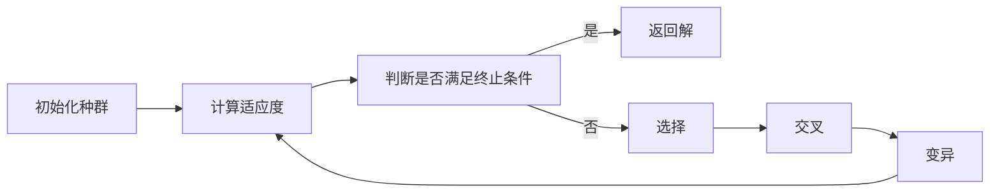

## Introduction

搜索是指提前规划并形成一个通往目标状态路径的动作序列，是一个前向计算的过程。

## Problem-Solving Agents

假设智能体能够访问与世界相关的信息，那么可以执行以下4个阶段的问题求解过程

1. 目标形式化 (Goal formulation): 将问题的目标形式化为一个目标状态
2. 问题形式化 (Problem formulation): 刻画实现目标所必需的状态和动作，进而得到一个抽象模型
3. 搜索 (Search): 在抽象模型上进行搜索，找到一个能达到目标的动作序列，这样的序列称为`解` (solution)
4. 执行 (Execution): 执行搜索得到的动作序列，一次执行一个动作，直到达到目标状态

搜索问题的形式化定义如下

- 初始状态 (initial state): 搜索开始时智能体所处的状态
- 状态空间 (state space): 所有可能的状态的集合
- 目标状态 (goal state): 智能体希望达到的状态
- 行动 (action): 智能体可以执行的动作；给定一个状态$$s$$，$$A(s)$$表示智能体在状态$$s$$下可以执行的动作的集合
- 转移模型 (transition model): 给定一个状态$$s$$和一个动作$$a$$，$$Result(s, a)$$表示在状态$$s$$下执行动作$$a$$后得到的新状态
- 动作代价函数 (action cost function): 给定一个状态$$s$$和一个动作$$a$$，$$Cost(s, a)$$表示在状态$$s$$下执行动作$$a$$的代价

一个动作序列形成一条路径 (path)，路径的代价是路径上所有动作的代价之和；解是从初始状态到目标状态的一条路径，解的代价是解的路径的代价；最优解是代价最小的解。

状态空间可以用图 (graph) 表示，图中的节点表示状态，图中的有向边表示动作，图中的边的属性/权重表示动作的代价。

## Search Algorithms

搜索算法的输入是搜索问题，输出是一个解或者报告无解。事实上我们并不希望解中有重复的状态，因此一般可以在状态空间图上叠加一层搜索树 (search tree)，搜索树中的节点表示状态，根节点表示初始状态，搜索树中的有向边表示动作，搜索树中的边的属性/权重表示动作的代价，搜索树中的每个节点都有一个父节点，表示上一步的状态。

使用搜索树可以对节点进行扩展 (expand)，即从一个节点出发，根据转移模型和动作代价函数，生成该节点的所有子节点[^1]，即下一步的可能状态。每一步的搜索都是通过扩展当前搜索树的叶子节点来进行的；已扩展过的节点对应的状态称为已达 (reached) 状态，未扩展过的节点是搜索树的边界 (frontier)。图搜索和树搜索都是扩展边界上的节点，区别在于图搜索在扩展时会检查节点是否已达（维护一个闭节点表），如果已达则不扩展该节点。

[^1]: 生成的子节点中不应当包括已达状态，否则会导致无限循环

### Best-First Search (最佳优先搜索)

最佳优先搜索是一种比较通用的搜索方法，其重点在于评估函数 (evaluation function) $$f(n)$$，评估函数是一个从节点到实数的映射，表示从初始状态到目标状态的代价估计，最佳优先搜索每次都扩展评估函数值最小的节点。

在每次迭代过程，选择边界上$$f(n)$$最小的节点进行扩展:

- 若该节点是目标状态，则搜索结束，返回该节点的路径
- 否则，扩展该节点的子节点
  - 若子节点未达，则将子节点加入边界
  - 若子节点已达，且$$f(n^{\prime})$$值比$$f(n)$$值小，则将子节点加入边界；已达状态重新加入边界的条件是该节点的路径代价比之前的路径代价更小
- 若边界为空，则搜索失败，返回无解

### Search Data Structures

一个树搜索 (tree search) 算法的实现需要以下数据结构:

```python
class Node: # 树搜索中的节点
    def __init__(self, state, parent=None, action=None, path_cost=0):
        self.state = state # 节点对应的状态
        self.parent = parent # 父节点，即上一步的状态
        self.children = [] # 子节点，即下一步的状态表
        self.action = action # 从父节点到该节点的动作
        self.action_cost = 0 # 从父节点到该节点的动作代价
        self.path_cost = path_cost # 从初始状态到该节点的路径代价
        self.depth = 0 # 节点的深度

    def path(self):
        node, path_back = self, []
        while node:
            path_back.append(node.state) # 将节点的状态加入路径中
            node = node.parent # 回溯到父节点
        return list(reversed(path_back))
    
    def cloeset_child(self):
        if len(self.children) == 0: return None
        else: return min(self.children, key=lambda x: x.action_cost) # 返回子节点中代价最小的节点

class Frontier:
    def __init__(self):
        self.container = [] # 用于存储边界上的节点
        self.value = []
        self.reached = {} # 用于存储已达状态
    
    def empty(self): return len(self.container) == 0 # 判断边界是否为空
    
    def add(self, node, list_type='priority', value=None):
        list_type = list_type.lower()
        if list_type == 'priority':
            index = 0
            while self.value[index] < value:
                index += 1
            self.container.insert(index, node) # 将节点加入边界中，按照路径代价从小到大排序
            self.value.insert(index, value) # 将节点的评估函数值加入边界中，按照评估函数值从小到大排序
        elif list_type == 'fifo': self.container.append(node) # 将节点加入边界中
        elif list_type == 'lifo': self.container.insert(0, node) # 将节点加入边界中
        else: raise Exception('Invalid type')
    
    def top(self):
        if self.empty(): raise Exception('Frontier is empty')
        else: return self.container[0] # 返回边界上的第一个节点
    
    def pop(self):
        if self.empty(): raise Exception('Frontier is empty')
        else:
            res = self.container[0] # 从边界中取出节点
            self.container = self.container[1:] # 弹出边界中的第一个节点
            return res
    
    def __contains__(self, node): return any(node.state == n.state for n in self.container) # 判断节点是否在边界上
    def __reached__(self, node): return node.state in self.reached # 判断节点是否已达
```

搜索算法使用了3种不同类型的队列(存储边界上的节点):

- 优先队列 (priority queue): 每次从边界中取出评估函数值最小的节点
- 先进先出队列 (first-in first-out queue): 首先弹出的是最早加入边界的节点，用于宽度优先搜索
- 后进先出队列 (last-in first-out queue): 首先弹出的是最晚加入边界的节点，用于深度优先搜索

已达状态可以存储为一个查找表 (lookup table)，例如哈希表 (hash table)，每个键值对的键是状态，值是该状态对应的节点。

### Redundant Paths (冗余路径)

循环是冗余路径的一种特殊情况，冗余路径是指从初始状态到目标状态的路径中包含重复的状态。解决冗余路径的方法有3种:

1. 记录所有已达状态，若新加入边界的节点对应的状态已经在已达状态中，则不加入边界
2. 不引入额外的记录，交给算法处理；如果搜索算法会检查冗余路径，那么就是图搜索 (graph search)，否则就是树搜索 (tree search)
3. 检查循环，但不检查冗余路径；通过对每个节点的父节点进行追溯，检查是否有循环

### Measuring problem-solving performance (衡量问题求解性能)

1. 完备性 (completeness): 搜索算法是否能够找到解
2. 代价最优性 (cost optimality): 搜索算法是否能够找到最优解
3. 时间复杂度 (time complexity): 搜索算法的时间复杂度
4. 空间复杂度 (space complexity): 搜索算法的空间复杂度

## Uninformed Search Strategies

### Breadth-First Search (宽度优先搜索)

宽度优先搜索 (亦称广度优先搜索) 是一种树搜索算法，其使用先进先出队列作为边界，每次从边界中取出最早加入边界的节点进行扩展；当BFS扩展深度为d的节点时，说明深度为d-1的节点都已经扩展过了，因此BFS能找到一个路径最短的解。

```python
def BFS(root, goal_state):
    frontier = Frontier() # 边界，使用先进先出队列
    frontier.add(root, type='fifo') # 将初始状态加入边界中
    while not frontier.empty():
        node = frontier.pop() # 从边界中取出节点
        if node.state == goal_state: return node.path() # 若节点是目标状态，则返回该节点的路径
        for child in node.children: # 扩展节点的子节点
            child.parent = node # 将子节点的父节点设为该节点
            frontier.add(child, type='fifo') # 将子节点加入边界中
    return None # 若边界为空，则返回无解
```

BFS的问题是空间复杂度很高，因为它需要存储边界上的所有节点，对内存的要求很高；BFS没有考虑动作的代价，因此它不一定是代价最优解。

### Uniform-Cost Search (一致代价搜索)

一致代价搜索使用优先队列，每次从边界中取出路径代价最小的节点进行扩展；具体来说，每次迭代时，遍历边界上的节点和已达节点中尚有未扩展子节点的节点，选择路径代价最小的节点进行扩展。

```python
def UCS(root, goal_state):
    frontier = Frontier() # 边界，使用优先队列
    frontier.add(root, type='priority', value=root.path_cost) # 将初始状态加入边界中
    while True:
        if frontier.empty(): return None # 若边界为空，则返回无解
        node,child = min(
            [(node,child) for node in frontier.container for child in node.closest_child()],
            key=lambda x: x[1].path_cost # 从边界中取出路径代价最小的节点
        )
        node.children.remove(child) # 将子节点从父节点的子节点表中删除
        if len(node.children) == 0: frontier.container.remove(node) # 若父节点的子节点表为空，则将父节点从边界中删除
        child.parent = node # 将子节点的父节点设为该节点
        if child.state == goal_state: return child.path() # 若节点是目标状态，则返回该节点的路径
        frontier.add(child, type='priority', value=child.path_cost) # 将子节点加入边界中
```

UCS是完备的，因为它会扩展所有的节点；UCS是代价最优的，因为它得到的第一个解的代价至少与边界上其他节点的代价一样小。

### Depth-First Search (深度优先搜索)

深度优先搜索优先扩展深度最深的节点，因此使用后进先出队列[^2]，评价函数可以看作节点深度的负数，这样深度越深，代价越低；深度优先搜索不一定能找到最优解，因为它可能会陷入局部最优解，因此他在树搜索中完备，但在图搜索中并不完备；在有环时，深度优先搜索可能会陷入无限循环。

[^2]: 实际上使用回溯方法，不需要reached表，也不需要记录节点的扩展次数，所需的内存空间更少

```python
def DFS(root, goal_state):
    frontier = Frontier() # 边界，使用后进先出队列
    frontier.add(root, type='priority', value=-root.depth) # 将初始状态加入边界中
    while not frontier.empty():
        node = frontier.pop() # 从边界中取出节点
        if node.state == goal_state: return node.path() # 若节点是目标状态，则返回该节点的路径
        for child in node.children: # 扩展节点的子节点
            child.parent = node # 将子节点的父节点设为该节点
            child.depth = node.depth + 1 # 将子节点的深度设为父节点的深度加1
            frontier.add(child, type='priority', value=-child.depth) # 将子节点加入边界中
    return None # 若边界为空，则返回无解

def Backtracking(node, goal_state):
    if node.state == goal_state: return node.path() # 若节点是目标状态，则返回该节点的路径
    for child in node.children: # 扩展节点的子节点
        child.parent = node # 将子节点的父节点设为该节点
        res = Backtracking(child, goal_state) # 递归调用回溯方法
        if res is not None: return res # 若子节点是目标状态，则返回该节点的路径
    return None # 若节点的所有子节点都不是目标状态，则返回无解
```

### Depth-Limited and Iterative Deepening Search (深度限制搜索和迭代加深搜索)

深度受限搜索 (depth-limited search) 是深度优先搜索的变体，其在深度达到限制时停止扩展节点，好处是防止陷入循环；深度限制搜索是不完备的，因为最大深度可能不够大，导致无法找到解。

迭代加深搜索 (iterative deepening search) 是深度限制搜索的变体，其在深度达到限制时停止扩展节点，但是会逐渐增加深度限制，直到找到解为止；迭代加深搜索是完备的；通常，当搜索状态空间大于内存容量而且解的深度未知时，迭代加深搜索是首选的无信息搜索方法。

### Bidirectional Search (双向搜索)

同时从初始状态和目标状态开始搜索，直到两个搜索树相遇；每次迭代时扩展两个边界中代价最小的节点；双向搜索是完备的；双向搜索过程可以使用不同的搜索策略，如果使用BFS或UCS且动作代价全都相同，那么双向搜索是代价最优的

### Comparing Uninformed Search Strategies

| 指标       | BFS    | UCS | DFS | DLS | IDS    | Bi-directional |
| ---------- | ------ | --- | --- | --- | ------ | -------------- |
| 完备性     | 是     | 是  | 否  | 否  | 是     | 是             |
| 代价最优性 | 是[^3] | 是  | 否  | 否  | 是[^3] | 是 [^3]        |


[^3]: 如果每一步的代价都是相同的，那么BFS和IDS都是代价最优的

## Informed (Heuristic) Search Strategies (启发式搜索)

启发式搜索函数$$h(n)$$是从当前节点状态到目标状态的最小代价的估计

### Greedy Best-First Search (贪心最佳优先搜索)

贪心最佳优先搜索使用优先队列，每次从边界中取出启发式函数值最小的节点进行扩展。

### A\* Search (A\*搜索)

A\*搜索的评价函数是$$f(n)=g(n)+h(n)$$，其中$$g(n)$$是从初始状态到节点$$n$$的路径代价，$$h(n)$$是从节点$$n$$到目标状态的最小代价的估计，$$f(n)$$是从初始状态到目标状态的最小代价的估计；A\*搜索使用优先队列，每次从边界中取出评价函数值最小的节点进行扩展；A\*搜索是完备的；代价最优性取决于启发式函数$$h(n)$$的质量。

可容许 (admissible)的启发函数是指对于任意的节点$$n$$，有$$h(n)\leq h^*(n)$$，其中$$h^*(n)$$是从节点$$n$$到目标状态的最小代价的实际值；可容许的启发式函数的估计值不会超过实际值，因此可容许的启发式函数是比较保守的估计函数；可容许的启发函数一定是最优的，假设最优路径的代价是$$C^*$$，但是$$f(n)$$返回的代价$$C>C^*$$，并且$$n$$是最优路径上的一个节点:

$$
\begin{aligned}
f(n) &= g(n) + h(n)&\\
f(n)&>C^*& \text{假设估计值大于最优解代价}\\
f(n)&=g^*(n)+h(n)&\text{从初始状态到节点n的路径代价是最优的}\\
f(n)&\leq g^*(n)+h^*(n)&\text{可容许的启发式函数的估计值不会超过实际值}\\
f(n)&\leq C^*&\text{由上一步推出，与假设矛盾}\\
\end{aligned}
$$

一致性 (consistency) 是指对于任意的节点$$n$$和$$n$$的子节点$$n^{\prime}$$，有$$h(n)\leq Cost(n, n^{\prime})+h(n^{\prime})$$，即从节点$$n$$到目标状态的最小代价的估计不会超过从节点$$n$$到子节点$$n^{\prime}$$的代价加上从子节点$$n^{\prime}$$到目标状态的最小代价的估计；一致性是可容许的启发式函数的充分条件，即一致的启发式函数一定是可容许的启发式函数，是比可容许的启发式函数更强的条件。

$$
\begin{aligned}
f(n^{\prime}) &= g(n^{\prime}) + h(n^{\prime})&\\
&= g(n) + Cost(n, n^{\prime}) + h(n^{\prime})&\\
&\geq g(n) + h(n)\\
&= f(n)
\end{aligned}
$$

一致的启发式函数下一步的估计值不会比当前节点的估计值更小，因此任一状态的估计值都不会超过目标状态的估计值，即解的实际值，所以一致的启发式函数是可容许的启发式函数。

$$
\begin{aligned}
h(n^i) &\leq Cost(n^i, n^{i+1}) + h(n^{i+1})&\\
&\leq Cost(n^i, n^{i+1}) + Cost(n^{i+1}, n^{i+2}) + h(n^{i+2})&\\
&\leq \underbrace{Cost(n^i, n^{i+1}) + \dots + Cost(n^{i+k-1}, n^{i+k})}_{h^*(n^i)} + \underbrace{h(n^{i+k})}_{0}&\\
\end{aligned}
$$

### Search Contours (搜索等值线)

类似地图中的等高线，搜索等值线是指所有代价相同的节点的集合，如果等值线的值为$$400$$，那么对所有等值线内的节点$$f(n)=g(n)+h(n)\leq 400$$；等值线的作用是可视化搜索，因为A\*搜索扩展的是$$f(n)$$最小的节点，因此搜索等值线可以帮助我们理解搜索的过程。

实际已有代价$$g(n)$$是单调递增的，而$$g(n+1)=g(n)+Cost(n, n+1)$$，因此如果$$f(n)$$是一致的，那么$$f(n+1)=g(n+1)+h(n+1)=g(n)+Cost(n, n+1)+h(n+1)\geq g(n)+h(n)=f(n)$$，即$$f(n)$$是单调递增[^4]的，因此搜索等值线是单调递增的。

[^4]: 单调启发式函数是一致启发式函数的同义词

假设最优路径代价是$$C^*$$，那么我们扩展的所有节点 (必然扩展节点) 都满足$$f(n)\leq C^*$$，因此搜索等值线的值不会超过$$C^*$$，即搜索等值线$$C^*$$外的节点都不会被扩展，因此搜索等值线$$C^*$$是最优解的边界；换句话说，A\*搜索实现了对边界外的节点的剪枝。

### Satisficing Search (满意搜索)

满意解 (satisficing solution) 是指代价低于某个阈值的解，即考虑那些非最优解的次优解；满意搜索 (satisficing search) 是指搜索满意解的搜索算法。

受等值线的启发，我们可以将满意搜索看成对等值线的值的扩大[^5]；一般地，我们令$$f(n)=g(n)+wh(n)$$，其中$$w$$是一个大于1的常数，$$h(n)$$是启发式函数，$$f(n)$$是从初始状态到目标状态的最小代价的估计；当$$w=1$$时，满意搜索退化为A\*搜索。

使用加权搜索可能会扩大搜索空间，但同时也可能会降低搜索时间，因为增加了搜索的广度和解的数量。

[^5]: 加权A\*搜索是有界的

## Local Search and Optimization Problems (局部搜索和优化问题)

局部搜索 (local search) 是指不考虑从初始状态到目标状态的路径，而是考虑如何从初始状态到目标状态的状态；局部搜索的优点是不需要存储整个状态空间，因此可以处理非常大的状态空间；局部搜索的缺点是可能会陷入局部最优解，因此局部搜索不一定能找到最优解。

### Hill-Climbing Search (爬山搜索)

爬山搜索 (hill-climbing search) 是一种局部搜索算法，其从初始状态开始，每次都扩展当前状态的最优子节点，直到达到局部最优解。

### Simulated Annealing (模拟退火)


模拟退火[^6] (simulated annealing) 与爬山算法类似，不同点在于不选择最优解，而是以一定概率随机移动，具体来说:

[^6]: 模拟退火的思想是模拟金属退火的过程，金属在高温下会变得柔软，因此可以接受劣解，而在低温下会变得坚硬，因此不接受劣解

- 如果扩展节点更优，则移动到该节点
- 否则以一定概率移动到该节点

扩展节点的优劣对应$$\Delta E$$的正负，$$\Delta E$$是当前节点与扩展节点的评价函数值的差，$$\Delta E<0$$表示扩展节点是一个坏解，使用指数函数将概率控制在$$(0, 1)$$之间；此外还有一个随时间降低的温度参数$$T$$，$$T$$越大，接受劣解的概率越大，$$T$$越小，接受劣解的概率越小[^7]。这个概率可以用玻尔兹曼分布 (Boltzmann distribution) 表示:

$$
P(\Delta E) = e^{\frac{\Delta E}{T}} \quad \Delta E < 0, T > 0
$$

[^7]: $$T$$较大时会使$$\frac{\Delta E}{T}$$更接近0，此时接受劣解的概率较大；$$T$$较小时会使$$\frac{\Delta E}{T}$$更接近$$-\infty$$，此时接受劣解的概率较小；因此$$T$$越小，越趋向于爬山算法，即只接受更优的解。

### Local Beam Search (局部束搜索)

局部束搜索 (local beam search) 是一种局部搜索算法，其从$$k$$个随机生成的状态开始，每次都扩展当前状态的全部子节点，然后选择其中最优的$$k$$个节点作为下一次迭代的初始状态，直到达到局部最优解。

局部束搜索不是简单的并行算法，因为$$k$$个搜索过程可以共享信息，例如全局最优或避免重复搜索。

### Genetic Algorithms (遗传算法)

#### 基本概念

- 种群 (population): 多个备选解的集合
  - 个体 (individual): 种群中的一个备选解
  - 个体的编码 (encoding): 个体的表示方法，例如二进制编码、格雷码、符号编码等
- 适应度 (fitness): 个体的质量，用于评价个体的好坏
  - 适应函数 (fitness function): 用于计算个体的适应度
  - 适应函数的值 (fitness value): 个体的适应度，值越大解被保留的概率越大
  - 精英主义 (elitism): 保留适应度最高的个体，不参与遗传操作而是直接复制到下一代中
- 遗传操作 (genetic operator): 用于产生新个体的操作，包括选择 (selection)、交叉 (crossover) 和变异 (mutation)
  - 选择 (selection): 选择个体，用于产生下一代的种群，被选中的概率与适应度成正相关
  - 交叉 (crossover): 交换个体的编码，用于产生下一代的种群
  - 变异 (mutation): 改变个体的编码，有利于种群的多样性

#### 基本过程

1. 初始化种群，随机生成多个个体并对其编码
2. 计算每个个体的适应度，并对其评价
3. 判断是否满足终止条件，若满足则返回解，否则继续
4. 通过适当的选择方法选择个体，通常适应度越高的个体被选中的概率越大
5. 通过适当的交叉方法交换个体的编码，用于产生下一代的种群
6. 变异的发生概率很小，但是变异的个体可能会被选中，随机改变个体的编码生成新个体；变异操作主要用于解决早熟问题，即种群过早地收敛到局部最优解
7. 重复步骤2-6，直到满足终止条件



## Local Search in Continuous Spaces (连续空间中的局部搜索)

假设搜索问题的评估函数是连续可微的，其输入是一个n维向量$$x = (x_1, x_2, \dots, x_n)$$，对应n个变量，输出是一个实数$$f: \mathbb{R}^n \rightarrow \mathbb{R}$$，表示目标函数的值，目标函数是指需要优化的函数，例如最小化函数值；记$$\nabla f(x)$$为目标函数在$$x$$处的梯度:

$$
\nabla f(x) = \left(\frac{\partial f}{\partial x_1}, \frac{\partial f}{\partial x_2}, \dots, \frac{\partial f}{\partial x_n}\right)
$$

梯度下降法 (gradient descent) 是一种局部搜索算法，其使用梯度 (gradient) 的信息来指导搜索方向，梯度是一个向量，指向函数值增加最快的方向，梯度下降法的思想是沿着梯度的反方向进行搜索，直到达到局部最优解。

$$
x \leftarrow x + \alpha \nabla f(x)
$$

牛顿法 (Newton's method) 是一种局部搜索算法，其使用梯度和海森矩阵 (Hessian matrix) 的信息来指导搜索方向，海森矩阵是一个方阵，其第$$i$$行第$$j$$列的元素是$$\frac{\partial^2 f}{\partial x_i \partial x_j}$$，牛顿法的思想是沿着海森矩阵的逆矩阵的方向进行搜索，直到达到局部最优解。

$$
x\leftarrow x - H_f^{-1} \nabla f(x)
$$

约束优化 (constrained optimization) 是指优化问题中存在约束条件的优化问题，例如线性规划 (linear programming) 问题；线性规划问题是凸优化 (convex optimization) 问题的一种特殊情况，凸优化问题是指目标函数是凸函数 (convex function) 的优化问题，凸函数是指函数的二阶导数大于等于0的函数。