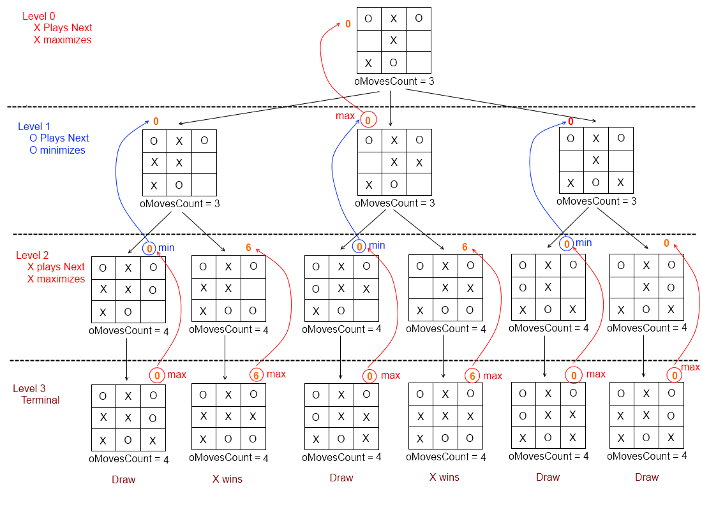

### 双人零和博弈

双人零和博弈 (two-player zero-sum game) 是指两个玩家的收益之和为零的博弈，是一种确定性的、双人、轮流、完全可观测的零和博弈；零和意味着一方的收益等于另一方的损失，即一方的收益为正，另一方的收益为负，两者之和为零。

在博弈的形式化定义中，通常用移动 (move) 来代替动作 (action)，用局面 (position) 来代替状态 (state)，用玩家 (player) 来代替代理 (agent)。形式化定义一般需要以下几个要素：

- 初始状态 (initial state, $S_0$)：博弈开始时的局面。
- 终止状态 (terminal state, $S_T$)：博弈结束时的局面。
- Is_Terminal($S$)：判断局面 $S$ 是否为终止状态。
- To_Move($S$)：返回局面 $S$ 中应该移动的玩家。
- Actions($S$)：返回局面 $S$ 中所有可能的移动。
- Result($S$, $a$)：返回局面 $S$ 中玩家采取动作 $a$ 后的局面。
- Utility($S$, $P$)：返回玩家 $P$ 在局面 $S$ 中的收益。
  - 当博弈只在两个玩家之间就行时，效用函数可以返回一个实数$f\rightarrow \mathbb{R}$，表示玩家$P_1$的收益，玩家$P_2$的收益为$-\text{Utility}(S)$，即玩家$P_2$的收益为玩家$P_1$的损失。
  - 当博弈在多个玩家之间进行时，效用函数可以返回一个向量$f\rightarrow \mathbb{R}^n$，表示每个玩家的收益。

博弈树 (game tree) 是一种树形结构，它的每个节点都是一个局面，每个节点的子节点都是该节点的所有可能移动的结果。博弈树的叶子节点是终止状态，博弈树的根节点是初始状态。博弈树的高度是博弈的回合数，博弈树的宽度是每个局面的可能移动数。



### 极小极大搜索

每个参与者都以最优策略行动，在每一步决策时都选择自身收益最大的动作，即

$$
\max\limits_{a \in Actions(S)}  \text{Utility}(Result(S, a), P)
$$

极小极大化搜索是一种递归式的搜索算法，它的思想是在每一步决策时，假设对手会采取最优策略，然后选择自身收益最大的动作。在每一步决策时，都会递归地调用极小极大化搜索，直到博弈结束。

```python
def Minimax_Search(state) -> action:
    player = To_Move(state) # 当前玩家
    value, action = Max_Value(state, player) # 极小极大化搜索
    return action # 返回最优动作 

def Max_Value(state, player: int) -> (value, action):
    if Is_Terminal(state): # 终止状态
        return Utility(state, player), None # 返回收益，动作为空
    value = -np.inf # 最大收益
    action = None # 最优动作
    for a in Actions(state): # 遍历所有可能的动作
        next_state = Result(state, a) # 采取动作后的局面
        next_player = To_Move(next_state) # 下一步的玩家
        next_value, _ = Max_Value(next_state, next_player) # 递归调用极小极大化搜索
        if next_value[player] > value: # 更新更大的收益和更优的动作
            value = next_value[player] # 更新最大收益
            action = a # 更新最优动作
    return value, action # 返回最大收益和最优动作
```

### Alpha-Beta 剪枝

考虑博弈树中某一层的一个节点，若玩家在同层的节点或更上层的节点中有更好的选择，那么该节点将不再会被访问，因为玩家不会选择它。Alpha-Beta 剪枝算法就是利用这一思想，减少极小极大化搜索的节点访问次数。在极小极大化搜索的基础上，我们需要为每位玩家维护一个已知的最大收益列表，在搜索过程中，如果某个节点的最大收益小于已知的最大收益，那么该节点将不再会被访问。

```python
def Alpha_Beta_Search(state) -> action:
    max_reached_value = [-np.inf] * num_players # 已知的最大收益列表
    player = To_Move(state) # 当前玩家
    value, action = Max_Value(state, player, max_reached_value) # 极小极大化搜索
    return action # 返回最优动作

def Max_Value(state, player: int, max_reached_value: list) -> (value, action):
    if Is_Terminal(state): # 终止状态
        return Utility(state, player), None # 返回收益，动作为空
    value = max_reached_value[player] # 已知的最大收益
    action = None # 最优动作
    for a in Actions(state): # 遍历所有可能的动作
        next_state = Result(state, a) # 采取动作后的局面
        next_player = To_Move(next_state) # 下一步的玩家
        next_value, _ = Max_Value(next_state, next_player, max_reached_value) # 递归调用极小极大化搜索
        if next_value[player] > value: # 更新更大的收益和更优的动作
            value = next_value[player] # 更新最大收益
            action = a # 更新最优动作
            max_reached_value[player] = value # 更新已知的最大收益
        else:
            break # 剪枝
    return value, action # 返回最大收益和最优动作
```

### 移动顺序

## Heuristic Alpha-Beta Search (启发式$\alpha$-$\beta$搜索)

为了充分利用有限的计算资源和计算时间，使用评价函数 (evaluation function) 来代替效用函数，使用截断测试[^1] (cutoff test) 来代替终止状态的判断。评价函数是一种启发式函数，它可以对局面进行评估，但是它不一定能够准确地评估局面的价值。

[^1]: 对于终止状态，截断测试必然返回真。

对于终止状态，评价函数必须返回准确的效用值，即$\text{Eval}(S, P) = \text{Utility}(S, P)$。对于非终止状态，评价函数的值必须介于输和赢之间，即$\text{Eval}(S, P) \in [\text{Utility}(\text{loss}, P), \text{Utility}(\text{win}, P)]$。