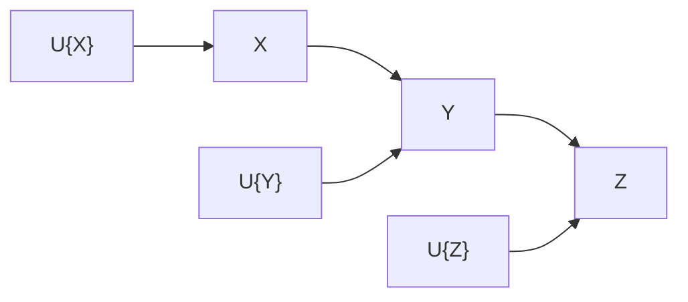
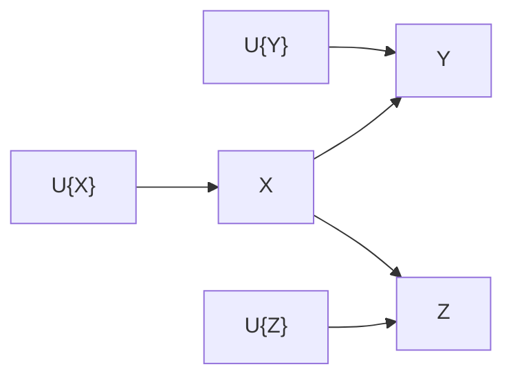
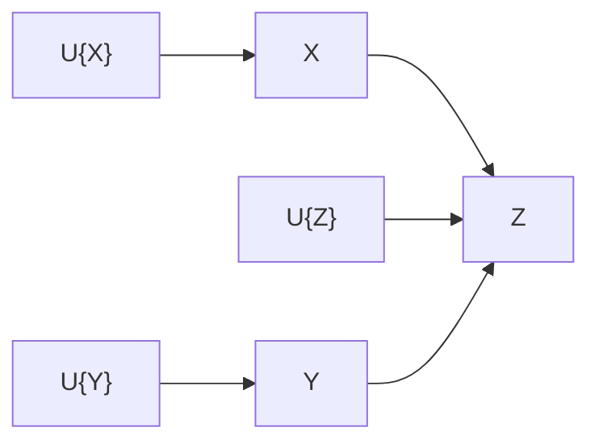

# 因果模型

因果模型是一种用于描述因果关系的模型，它可以用于预测和干预。因果模型的基本假设是，我们可以通过观察到的变量来推断未观察到的变量。

因果模型图是因果模型的一种可视化表示，它是一个有向无环图，其中节点表示变量，边表示因果关系，从一个变量指向另一个变量的边表示前者是后者的原因。

对因果模型图进行分析时：

1. 对于一个节点而言，它的所有父节点都是它的直接原因，它的所有子节点都是它的直接结果；它的所有祖先节点都是它的间接原因，它的所有后代节点都是它的间接结果。
2. 对于两个节点而言，如果它们通过一条边直接相连，那么它们互为因果；如果它们之间存在至少一条路径，那么通过引入更多的中间节点，它们可能互为因果。
3. 对于三个节点而言，其中一个节点位于连接另外两个节点的路径上，那么通过控制该中间节点，可以控制另外两个节点之间的关系。

## 乘积分解法则

对于[链结构](#链结构)而言，我们可以将联合概率分解为条件概率的乘积，即乘积分解法则。

$$
P(x_1, x_2, \cdots, x_n) = \prod_{i=1}^n P(x_i \vert pa(x_i))
$$

其中$$pa(x_i)$$表示$$x_i$$的父节点。

考虑一个简单的例子，假设有三个变量$$X$$、$$Y$$和$$Z$$，它们之间的关系为$$X \rightarrow Y \rightarrow Z$$，那么有

$$
P(X, Y, Z) = P(X)P(Y \vert X)P(Z \vert Y)
$$

## 结构因果模型

结构因果模型用于描述数据的产生机制，包括：

1. 外生变量集合$$U$$，它们是模型中的根节点，它们的值是由外部环境决定的，不依赖于模型中的其他变量。
2. 内生变量集合$$V$$，它们是模型中的非根节点，它们的值是由模型中的其他变量决定的，即至少依赖于一个父节点。
3. 确定内生变量取值的函数集合$$F$$，它们是模型中的边，它们的值是由父节点的值决定的，即它们是父节点的函数。

$$
V = F\{U\}
$$

## 因果模型图和独立性

以三个邻接的节点$$X$$、$$Y$$和$$Z$$为例，将三个节点直接相连，考虑边的方向，有三种情况：

1. 链结构：$$X \rightarrow Y \rightarrow Z$$。
2. 分叉结构：$$X \leftarrow Y \rightarrow Z$$。
3. 对撞结构：$$X \rightarrow Y \leftarrow Z$$；也叫共因结构。

在独立性分析中，我们关注的是通过控制中间节点，是否可以推断出两个节点的独立性或依赖关系。通过下文的分析，我们可以得到如下结论：链结构和分叉结构中的独立性判断是类似的，而对撞结构中的独立性判断与它们不同。

### 链结构

在链结构中

- $$X=F_X\{U_X\}$$
- $$Y=F_Y\{X, U_Y\}$$
- $$Z=F_Z\{Y, U_Z\}$$

给定$$Y$$，$$X$$和$$Z$$只受外生变量影响，故$$X$$和$$Z$$独立，记作$$X \perp Z \vert Y$$

### 分叉结构

在分叉结构中

- $$X=F_X\{U_X\}$$
- $$Y=F_Y\{X, U_Y\}$$
- $$Z=F_Z\{X, U_Z\}$$

给定$$X$$，$$Y$$和$$Z$$只受外生变量影响，故$$Y$$和$$Z$$独立，记作$$Y \perp Z \vert X$$

### 对撞结构

在对撞结构中

- $$X=F_X\{U_X\}$$
- $$Y=F_Y\{U_Y\}$$
- $$Z=F_Z\{X, Y, U_Z\}$$

不给定额外信息，$$X$$和$$Y$$独立；给定$$Z$$，$$X$$和$$Y$$的关系内含于$$Z=F_Z\{X, Y, U_Z\}$$，故$$X$$和$$Y$$不独立，记作$$X \not\perp Y \vert Z$$

### d-分离

$$d$$-分离是一种判断两个节点是否独立的方法，它是基于因果模型图的有向路径的概念的。在前文的讨论中，我们通过控制中间结点说明：控制中间节点后的`链结构`和`分叉结构`中的两个节点`独立`，而`对撞结构`中的两个节点`不独立`。

此处我们给出`阻断`的概念：一条路径会被一组节点$$Z$$阻断，当且仅当：

1. 该路径中包含链结构或分叉结构，且该结构中的中间节点在$$Z$$中。
2. 该路径中包含对撞结构，且该结构中的中间节点不在$$Z$$中。

我们可以将阻断的概念理解为：阻断了因果关系的传递，使得节点互相独立。如果一组节点$$Z$$阻断了节点$$X$$和$$Y$$之间的所有路径，那么$$X$$和$$Y$$在给定$$Z$$的条件下是$$d$$-分离的，记作$$X \perp_d Y \vert Z$$或$$X \perp Y \vert Z$$。

## 干预

干预是将变量固定为某个值，限制改变量的变化，等价于在因果模型中去除所有指向该变量的边。干预后的因果模型图称为干预模型图。

`干预`与`条件`的区别在于干预改变了系统本身，而条件只是改变了系统的观测。一般用条件概率表示因果效应

$$
\begin{aligned}
\text{干预 }& P(Y=y \vert do(X=x)) \\
\text{条件 }& P(Y=y \vert X=x)
\end{aligned}
$$

在只有观测数据时，我们只能从数据中估计干预操作的效果，称之为`校正`。校正公式描述了从观测数据中估计干预后的目标变量$$Y$$的概率分布

$$
\begin{aligned}
P(Y=y \vert do(X=x)) &= P(Y=y \vert X=x) \\
\text{全概公式 }&= \sum P(Y=y\vert X=x,Pa(X)=z)P(Pa(X)=z\vert X=x)\\
\text{独立性 }&= \sum P(Y=y\vert X=x,Pa(X)=z)P(Pa(X)=z)
\end{aligned}
$$

这里的$$Pa(X)$$表示$$X$$的父节点集合。

### 后门准则

后门准则应用于干预中$$X$$的父节点集合$$Pa(X)$$不可观测的情况，即试图找出一个可观测的变量集合$$Z$$，使得$$Z$$阻断了$$X$$和$$Y$$之间的所有伪因果路径。

给定因果模型图中的一对有序变量$$(X, Y)$$和一组变量$$Z$$，如果满足以下条件：

1. $$Z$$[阻断](#d-分离)了$$X$$和$$Y$$之间的每条含有指向$$X$$的路径。（阻断$$X$$和$$Y$$之间的所有伪因果/后门路径）
2. $$Z$$中没有$$X$$的后代节点。（保持$$X$$到$$Y$$的因果路径不变）

则称$$Z$$满足关于$$(X, Y)$$的后门准则。此时$$Z$$可以替代$$X$$的父节点集合$$Pa(X)$$，用于校正$$X$$的干预效果，即后门校正

$$
P(Y=y \vert do(X=x)) = \sum_z P(Y=y\vert X=x, Z=z)P(Z=z)
$$

### 前门准则

前门准则通过$$X$$到$$Y$$的中介变量估计因果效应。考虑因果模型图中的一对有序变量$$(X, Y)$$和一组变量$$Z$$，如果满足以下条件：

1. $$Z$$切断了所有从$$X$$到$$Y$$的路径。（阻断$$X$$和$$Y$$之间的所有因果路径）
2. $$X$$到$$Z$$没有后门路径。（保持$$X$$到$$Z$$的因果路径不变）
3. 所有$$Z$$到$$Y$$的后门路径都被$$X$$阻断。（保持$$Z$$到$$Y$$的因果路径不变）

则称$$Z$$满足关于$$(X, Y)$$的前门准则。此时$$Z$$可以替代$$X$$的父节点集合$$Pa(X)$$和后门校正来校正$$X$$的干预效果，即前门校正

$$
\begin{aligned}
P(Y=y \vert do(X=x)) &= \sum_z P(Z=z\vert X=x)\sum_{x^{\prime}}P(Y=y\vert X=x^{\prime}, Z=z)P(X=x^{\prime}\vert Z=z) \\
&= \sum_z \underbrace{P(Z=z\vert X=x)}_{X\rightarrow Z} \underbrace{\sum_{x^{\prime}}P(Y=y\vert X=x^{\prime}, Z=z)P(X=x^{\prime})}_{X\text{后门校正}Z\rightarrow Y}
\end{aligned}
$$

## 反事实

在完全一致的现实条件下，比较不同假设的结果，即反事实。反事实的表示为$$Y_x$$，表示在$$X=x$$的条件下，$$Y$$的取值。

给定结构因果模型，反事实计算分为三步

1. 用观测确定当前环境，即外生变量$$U$$的取值。
2. 用$$X=x$$替换$$X$$的定义，得到新的因果模型。(移除变量$$X$$出现在方程左边的情况，并用$$X=x$$替换）
3. 用新的因果模型计算$$Y$$的取值。

[后门](#后门准则)的反事实计算

$$
P(Y_x=y) = \sum_z P(Y=y\vert X=x, Z=z)P(Z=z)
$$